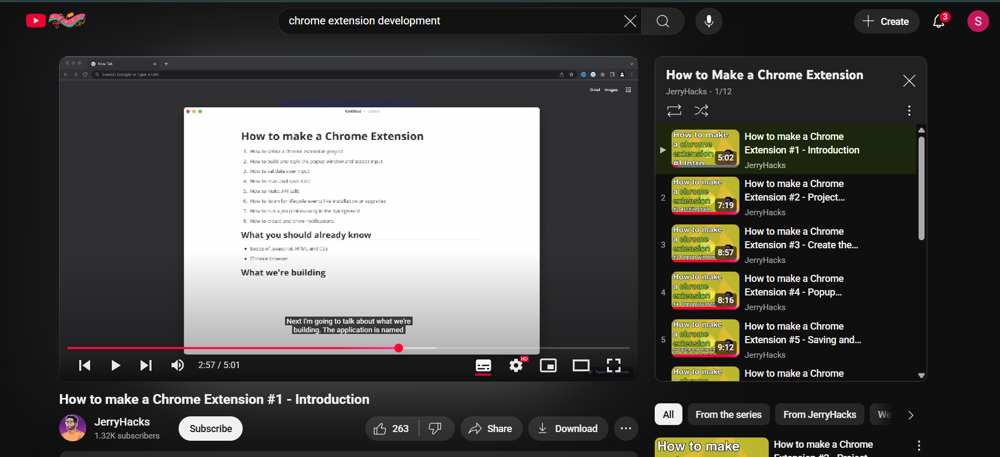
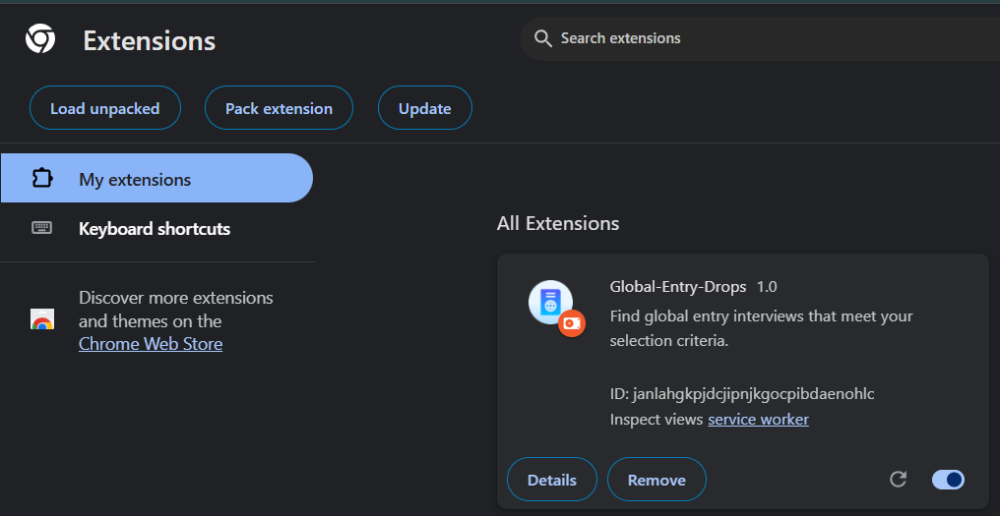
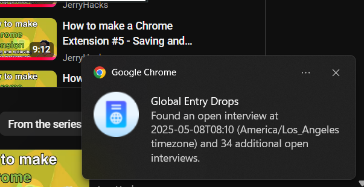

# Global Entry Drops (Clone)

> ⚠️ **This is a clone project built purely for educational purposes.**  
> It is based on a tutorial and replicates the core functionality of the original [Global Entry Drops](https://chromewebstore.google.com/detail/global-entry-drops/mljieicmojbnoockkgjfobamclclafmi) Chrome extension.

## 🧭 Overview

**Global Entry Drops** is a Chrome extension designed to help users find the **earliest available Global Entry interview slots** across selected locations.

Many users book interviews and later cancel them, opening up appointment times. This extension runs in the background to automatically detect and notify you when an earlier slot becomes available — saving you time and travel.

### ✅ Key Features of the Original Extension

- Select your preferred Global Entry interview location
- Choose your date range for appointment search
- Background script automatically checks for available slots
- Notifies users when an earlier interview is found

> 💡 Note: Chrome must remain open for the extension to function. It does not support mobile devices or multiple locations simultaneously.

---

## 📚 What I Learned

While creating this clone, I gained hands-on experience with:

- 📦 **Chrome Extension Structure**
  - Manifest file setup
  - Background and content scripts
  - Permissions management
- 🧠 **Event Handling**
  - Handling user interactions via popup and background scripts
- 🔔 **Browser Clickable Notifications**
  - Implementing and customizing Chrome's notification API, tabs API
- 🔍 **Working with APIs and Intervals**
  - Automating checks for updates at regular intervals
- 🌐 **Preparing an Extension for Web Store Publishing**
  - Learned the process to package and prepare a Chrome extension for publishing on the Chrome Web Store.
  - (Note: This project was not published since it is a clone developed for educational purposes only)

## 📸 Screenshots

Here are some previews of the extension in action:

- **Youtube Tutorial**

- **Extension Popup UI**

- **Notification Example**

- **Chrome Extension Loaded**

This project greatly improved my understanding of how Chrome extensions work under the hood.
